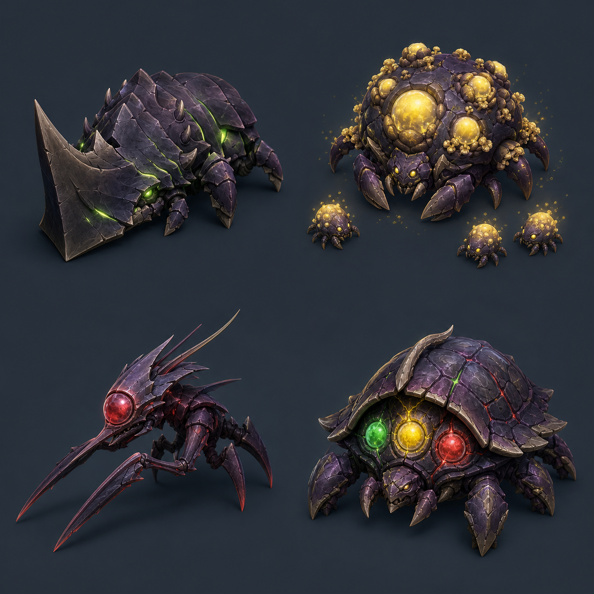

# 적 4종 설계 — 심핵 갑각군

## 공통 콘셉트

마력 코어의 파편을 먹고 갑각과 기관이 변이한 생물 군집이다. 공통적으로 짙은 보라색 갑각을 가지며, 약점과 요구 영웅은 발광색으로 전달한다.

- 초록: 방어형
- 노랑: 광역형
- 빨강: 궁수형
- 색만 사용하지 않고 방패·불꽃·조준점 모양도 함께 표시한다.

현재 구현 범위는 4번 `신호갑주 트리코어` 한 종류뿐이다. 나머지 세 종류는 신호갑주의 플레이테스트에서 회전과 상성 선택이 재미있다고 확인된 뒤 구현한다.

---

## 1. 철벽쇄각 램혼

### 외형과 읽기

- 정면을 완전히 덮는 거대한 쐐기 뿔과 겹갑옷
- 갑옷 틈에서 초록빛이 새어 나온다.
- 옆과 뒤의 작은 다리가 노출되어 정면과 후면이 즉시 구분된다.

### 행동

1. 등장 후 코어 방향을 고정한다.
2. 짧은 예고선과 함께 직선 돌진한다.
3. 코어 또는 영웅과 충돌하면 큰 피해를 준다.

### 상성

- 궁수형·광역형이 정면을 공격: 피해 35%, `BLOCKED`
- 방어벽과 충돌: 돌진 취소, 뒤집힘, `WEAK`
- 뒤집힌 2초 동안 모든 피해 3배

### 전투 역할

- 플레이어가 방어형을 진입 방향에 빠르게 배치하도록 압박한다.
- 화면에서 가장 즉각적인 우선순위를 만드는 적이다.

### 위험 신호

- 돌진 경로가 다른 적에게 가려지면 불공정하게 느껴질 수 있다.
- 방어벽 자동 생성 위치가 신뢰할 수 있어야 한다.

---

## 2. 황금포자모 블룸백

### 외형과 읽기

- 등에 크기가 다른 노란 포자 주머니가 가득한 둥근 모체
- 생성 직전 포자 주머니가 크게 부풀고 점멸한다.
- 작은 유충 세 마리가 몸 주변을 따라다닌다.

### 행동

1. 느리게 이동한다.
2. 일정 시간마다 유충 세 마리를 부채꼴로 생성한다.
3. 살아 있는 시간이 길수록 화면의 적 수가 늘어난다.

### 상성

- 궁수형: 본체 단일 피해는 정상이나 유충 정리가 느림
- 방어형: 이동은 막지만 증식은 계속됨
- 광역형이 포자 주머니와 유충을 함께 공격: 피해 2.5배, `WEAK`
- 폭발에 죽은 유충은 인접 유충에게 연쇄 폭발

### 전투 역할

- 광역형을 단순한 낮은 피해 영웅이 아니라 물량 해결사로 만든다.
- 방치할수록 문제가 커지는 중기 우선순위 적이다.

### 위험 신호

- 유충 수가 많으면 성능과 가독성을 해칠 수 있으므로 모체당 최대 수가 필요하다.
- 연쇄 폭발이 자동으로 발생해도 플레이어가 자신이 만든 결과라고 느껴야 한다.

---

## 3. 적안침수 핀아이

### 외형과 읽기

- 가늘고 날카로운 몸과 바늘 같은 앞다리
- 평소에는 붉은 수정 눈을 갑각으로 가린다.
- 공격 준비 중 눈을 크게 열고 붉은 조준선을 표시한다.

### 행동

1. 전장 바깥쪽에서 이동을 멈춘다.
2. 1.2초 동안 체력이 낮은 영웅 또는 코어를 조준한다.
3. 방해받지 않으면 강한 원거리 광선을 발사한다.

### 상성

- 눈이 닫힌 몸체: 모든 피해 50%, `BLOCKED`
- 조준 중 궁수형이 눈을 공격: 피해 3.5배, `CRITICAL`, 조준 취소
- 광역형·방어형은 눈이 열린 동안에도 피해 70%만 적용

### 전투 역할

- 궁수형의 좁은 범위를 정확히 맞추는 회전 판단을 요구한다.
- 가까운 적만 보고 있던 플레이어의 시선을 외곽으로 돌린다.

### 위험 신호

- 조준 시간이 너무 짧으면 회전 애니메이션 때문에 대응 불가능할 수 있다.
- 작은 눈 약점은 모바일 화면에서 과장해서 표시해야 한다.

---

## 4. 신호갑주 트리코어 — 현재 구현 대상

### 외형과 읽기

- 거대한 거북게 형태의 보라색 중갑 엘리트
- 체력이 낮아지면 등갑이 열리고 세 개의 신호 코어가 노출된다.
- 세 코어에는 색과 함께 방패·불꽃·조준점 모양이 표시된다.

### 행동

1. 체력 60%까지는 일반 중갑 적처럼 코어로 이동한다.
2. 체력 60% 이하에서 0.35초 경직되고 신호 코어가 열린다.
3. 초록 → 노랑 → 빨강 순서로 같은 적에게 세 영웅의 상태를 쌓는다.

### 3단 조합

1. 초록 / 방어형: 피해 1.35배, 1.5초 정지, `WEAK`
2. 노랑 / 광역형: 피해 1.5배, 3초 점화, `WEAK`
3. 빨강 / 궁수형: 피해 4배 + 추가 마무리 피해, `CRITICAL`
4. 완성: `3 HERO COMBO!`

### 오답 처리

- 현재 신호와 다른 영웅의 피해는 15%만 적용한다.
- `BLOCKED`를 표시하지만 단계는 초기화하지 않는다.
- 한 영웅의 연사나 폭발 잔여 공격이 다음 단계의 오답처럼 보이지 않도록 짧은 유예 시간을 둔다.
- 코어 영웅 공격은 조합을 진행하지 않으며 일반 피해만 준다.

### 전투 역할

- 한 적을 세 공격 범위로 차례로 넘기는 회전 자체가 재미있는지 검증한다.
- 체력이 많은 적의 후반부를 단순 화력전이 아닌 짧은 처형 퍼즐로 바꾼다.

### 위험 신호

- 정해진 순서가 매번 반복되면 작업처럼 느껴질 수 있다.
- 자동 공격이 플레이어 의도보다 먼저 단계를 바꾸거나 오답을 낼 수 있다.
- 신호가 적이나 이펙트에 가려지면 시스템 전체가 불공정하게 느껴진다.

---

## 영웅 상성 요약

| 적 | 방어형 | 광역형 | 궁수형 | 요구 판단 |
|---|---|---|---|---|
| 램혼 | 돌진 중단, 뒤집기 | 정면 피해 감소 | 정면 피해 감소 | 진입 방향을 막는다 |
| 블룸백 | 이동만 지연 | 포자·유충 연쇄 폭발 | 본체 단일 공격 | 증식 전에 태운다 |
| 핀아이 | 제한적 대응 | 제한적 대응 | 눈 약점 치명타 | 조준 중 외곽을 맞춘다 |
| 트리코어 | 1단 정지 | 2단 점화 | 3단 처형 | 한 적을 순서대로 넘긴다 |

## 향후 웨이브 조합 초안

재미 확인 후 아래 순서로 최소 조합부터 만든다.

1. 램혼 + 일반 소형: 돌진을 막는 동안 잡몹이 압박한다.
2. 블룸백 + 램혼: 증식 정리와 긴급 방어 중 우선순위를 고른다.
3. 핀아이 + 근접 군집: 외곽 조준과 코어 주변 물량 사이에서 회전한다.
4. 트리코어 + 소수 일반 적: 엘리트 조합에 집중하되 완전히 안전하지는 않다.
5. 세 상성 적 + 트리코어: 최종 검증용 혼합 웨이브. 처음부터 사용하지 않는다.

## 구현 게이트

다음 질문 중 대부분이 긍정일 때만 램혼·블룸백·핀아이를 구현한다.

- 신호만 보고 다음 영웅을 1초 안에 알 수 있는가?
- 적을 세 영웅에게 넘기는 회전이 번거로움보다 재미에 가까운가?
- 오답과 정답의 차이가 설명 없이 읽히는가?
- 마지막 치명타가 반복하고 싶을 만큼 통쾌한가?
- 자유 회전과 120도 스위치 양쪽에서 수행 가능한가?
